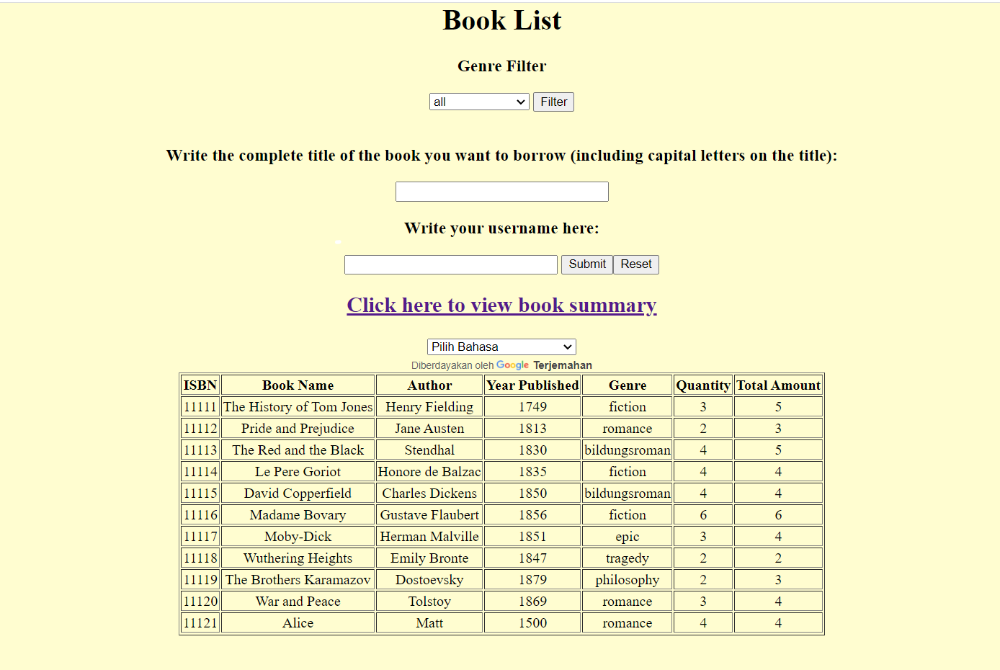
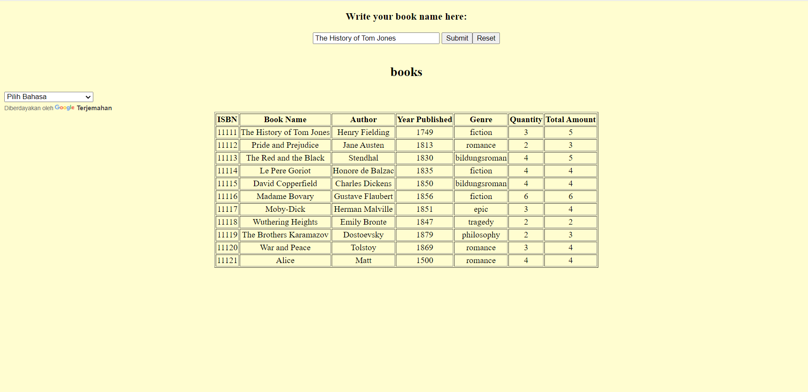
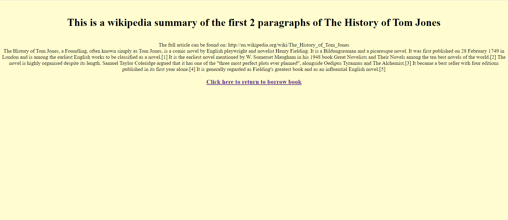

<H1> LibrarySystem 2.0.1 </H1>
This version of our library system adds to our initial version 1 of our library system that can be found here: https://github.com/310g17/librarySystem 
We decided to not branch and to create a new repository as this version is far different than the initial as a complete system overhaul was required. Methods from the first version may remain, however, the code will differ as we've abandoned the initial .csv approach to our system.  
Our initial goal still remains the same. Our team’s project is focused on the creation of a library system that primarily focuses on the borrowing feature of a library. The library system will be created as an app as we believe the mobility of a mobile device is handy for librarians that want to check and see book. Furthermore, our website is centred around 5 main features. Our primary feature will be the ability to check in and check out, this system will function around our book database that tracks our stock of books. Aside from borrowing and returning books, we also want to implement a simple filtering tool. There is another feature we decided to implement, which is the idea of an individual account. Users and administrators will have their own accounts, each with different access levels. Administrators have access to the addition and removal of borrowable books in the database of books. To support the library in terms of its security, we have decided to implement a tracking system for books. If a person has borrowed 2 books or an overdue book (books borrowed for over 2 weeks) they are unable to borrow more.  
The core functionalities of our system is still the same however, due to the previous systems limitations of using a .csv file to store our data we will transition into SQL for better code readability and overall performance. Furthermore, by using SQL we believe it will be easier to solve the issue of data storage.  
 

<h2>Changes since V2.0</h2>
<h3> Addition of Google Translate to the page </h3>  
In this new version of the website the menus leading up to the borrowing of books have beenn given a google translate button. This button works by choosing a language and then click submmit to change the entirety of the page to the selected page. This uses the HTML api for google translate and use scripts to translate the website.
 
 

<h3> Addition of a book summary via Wikipedia </h3> 
Version2.0.1 adds the addition of a book summary feature incorporated into the book list feature. Users are able to write any book into a form and upon submitting the form, users are sent to a new page and are shown the first 2 paragraphs of the Wikipedia page of said book. This utilizes the Java API Jsoup which is a page crawling API.
 

 
<H2>New API Added since V2.0</h2>
JSoup : Used to extract data from websites written in HTML. Taking information from specific tags. 
Java.net.URLEncoder : Encodes Strings to prepare URL’s. Used to support the JSoup API to stitch user input and the wikipedia URL. 
Google Translate web-api: Used to integrate Google’s translation service into HTML.  
