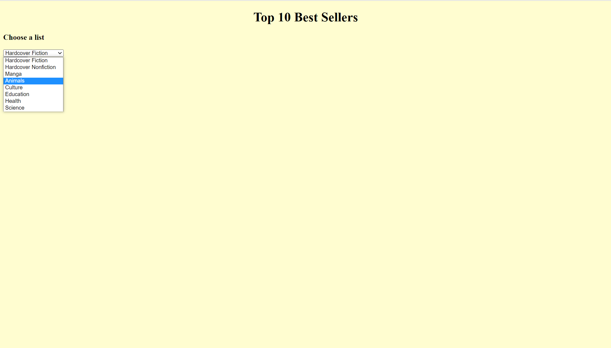

<H1> LibrarySystem2.0.1 </H1>
This version of our library system adds to our initial version 1 of our library system that can be found here: https://github.com/310g17/librarySystem 
We decided to not branch and to create a new repository as this version is far different than the initial as a complete system overhaul was required. Methods from the first version may remain, however, the code will differ as we've abandoned the initial .csv approach to our system.  
Our initial goal still remains the same. Our team’s project is focused on the creation of a library system that primarily focuses on the borrowing feature of a library. The library system will be created as an app as we believe the mobility of a mobile device is handy for librarians that want to check and see book. Furthermore, our website is centred around 5 main features. Our primary feature will be the ability to check in and check out, this system will function around our book database that tracks our stock of books. Aside from borrowing and returning books, we also want to implement a simple filtering tool. There is another feature we decided to implement, which is the idea of an individual account. Users and administrators will have their own accounts, each with different access levels. Administrators have access to the addition and removal of borrowable books in the database of books. To support the library in terms of its security, we have decided to implement a tracking system for books. If a person has borrowed 2 books or an overdue book (books borrowed for over 2 weeks) they are unable to borrow more.  
The core functionalities of our system is still the same however, due to the previous systems limitations of using a .csv file to store our data we will transition into SQL for better code readability and overall performance. Furthermore, by using SQL we believe it will be easier to solve the issue of data storage.  
 

<H2>New Features Since V2.0</H2> 

<H3>Addition of search book via Open Library</H3> 
In this new version of the wep application, search and best seller buttons are added to the main page. When search button pressed, it redirects user to the search page which user can type any book to the text box and press the search book button next to it. 10 most related books to the title will show up as output on the page with book name, author name and the picture of the book. Search bar uses the open library API for getting the data related to the book title. 
 

 
 

<H3>Addition of best seller page via New York Times</H3> 

When best sellers button is clicked on the main page, it redirects user to best sellers page. On this page user can choose many different types of genres with scroll bar to display. The page displays current top ten best selling books on that genre with the book name, author, picture of the cover and description. It uses New York Times API foe accessing to data.
 
 

 
 

<H3>Addition of book summary via New York Times</H3> 

V2.0.1 of the library system also has summary book option on the list book page. This way users can get more information about the book which they planning to borrow or that they are curious about. When user enters the title of the book, the page displays the name, author and the summary of it. This function also uses different method from New York Times API to get the data.
 
 

 
 

<H2>API's Added</H2> 

Open Library API: Used to search books from the title given.
New York Times API: Used to get best selling books for the specific list choosen and the summary information about the book from a title.